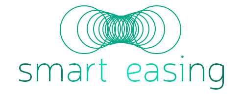

<div style="text-align:center">
  
</div>

<h3>Description</h3>
<p>
  The <code>smart-easing</code> library works like 
  <code>CSS</code> <em>animation</em> and <em>transition</em>, 
  except it's controlled with JavaScript.<br/>
  You can use the <code>smart-easing</code> library:
</p>
<ul>
  <li>anywhere that <code>CSS</code> <em>animation</em> and <em>transition</em> is limited</li>
  <li>to control the <code>DOM</code> elements flow via JavaScript</li>
  <li>to animate the <code>CSS</code> <strong>gradients</strong></li>
  <li>to animate <code>Canvas</code> <em>(eg. the graphs)</em></li>
  <li>to display the counting out numbers smoothly</li>
  <li>to move your autonomous car or steer your rocket with smooth moves</li>
</ul>

<h3>Documentation</h3>
<p>
  The full documentation with code samples can be found 
  <a target="_blank" href="https://devrafalko.github.io/smart-easing">here</a>.
</p>

<h3>How it works</h3>
<ul>
  <li>
    Check out the 
    <a target="_blank" href="https://devrafalko.github.io/smart-easing#section-samples">
    <strong>Samples</strong>
    </a> section in the 
    <a target="_blank" href="https://devrafalko.github.io/smart-easing">Documentation</a>.
  </li>
  <li>
    Check out the 
    <a target="_blank" href="https://devrafalko.github.io/smart-easing/simulator">easing simulator</a> 
    that shows how the <code>smart-easing</code> works on <code>DOM</code> and 
    <code>Canvas</code> samples with the built-in easing modes.
  </li>
</ul>

<h3>Implementation</h3>
<h4 data-id="implementation-nodejs">with NodeJS</h4>

```javascript
npm install smart-easing --save
```

```javascript
const { Animation, Blender } = require('smart-easing');
const animation = new Animation(/*...*/);
```

<h4 data-id="implementation-browser">with Browser</h4>

> Add <code>smart-easing.js</code> library to the HTML file.

<p>
  The library is located in <code>./dist/smart-easing.js</code> directory.<br/>
  It is a <span class="lang-name">webpack</span>&<span class="lang-name">babel</span> 
  bundled cross-browser library version.</br>
  The library is accessible as <code>smartEasing.Animation</code> and 
  <code>smartEasing.Blender</code> variables in the global 
  <code>window</code> scope.
</p>

```html
<head>
  <script src='smart-easing.js'></script>
  <script>
    var animation = new smartEasing.Animation(/*...*/);
  </script>
</head>`
```
<h3>Tests</h3>

```cmd
git clone https://github.com/devrafalko/smart-easing.git
cd smart-easing
npm install
npm test        //run tests in node
npm test deep   //run tests in node with errors shown
npm test-web    //run tests with karma + chrome
npm test-err    //run tests with karma + chrome with errors shown</code></pre>
```